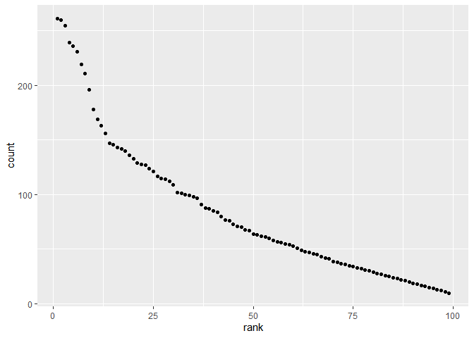

Homework 2
================
Kylie Wheelock Riley
9/25/2019

# Problem 1

## Importing and tidying Mr. Trash Wheel Data

``` r
library(readxl)
trash_wheel = read_excel(path = "./data/mr_trash_wheel_data_aug19.xlsx", 1) %>%
  janitor::clean_names() %>% 
  rename(vol_y3 = volume_cubic_yards, cigs = cigarette_butts) %>% 
  select(-x15) %>% 
  drop_na(dumpster:date) %>%
  mutate(sports_balls = round(sports_balls, 0)) %>% 
  mutate(sports_balls = as.integer(sports_balls))
```

## Importing and tidying 2017 precipitation data

``` r
precip_2017 = read_excel(path = "./data/mr_trash_wheel_data_aug19.xlsx", 6, skip = 1) %>% 
  janitor::clean_names() %>% 
  rename(total_in = total) %>% 
    mutate(
    total_in = na_if(total_in, 0),
    year = "2017") %>% 
  drop_na(total_in, month) %>% 
  select(year, month, total_in)
```

## Importing and tidying 2018 precipitation data

``` r
precip_2018 = read_excel(path = "./data/mr_trash_wheel_data_aug19.xlsx", 5, skip = 1) %>% 
  janitor::clean_names() %>% 
  rename(total_in = total) %>% 
  mutate(
    total_in = na_if(total_in, 0),
    year = "2018") %>% 
   drop_na(total_in, month) %>% 
  select(year, month, total_in)
```

## Joining 2017 and 2018 precipitation data

``` r
precip_bind = bind_rows(precip_2017, precip_2018) %>% 
  mutate(month = month.name[month])
```

Mr. Trash Wheel is a trash interceptor that removes trash as it enters
Baltimore’s Inner Harbor. Between May 2014 and August 2019 Mr.Trash
Wheel brought in a total of 344 dumpsters full of trash. The average
dumpster weighed 3.26 tons with a volume of 15.54 cubic yards. Trash
collected in the dumpsters included cigarette butts, plastic bottles,
sports balls, and grocery bags, among others. Mr. Trash Wheel is most
active just after a precipitation event. Between 2017 and 2018 there was
a total of 23 months with precipitation. 2017 had lower total
precipitation with 32.93 inches compared to a total of 70.33 inches in
2018. The median number of sports balls collected per dumpster in 2017
was 8 and the 2018 median was also 8.

# Problem 2

## Importing and tidying the monthly poll data

``` r
## Importing dataset
pols_month = read_csv(file = "./data/pols_month.csv") %>% 
  ## separating month from 1 column into 3
  separate(mon, into = c("year", "month", "day"), sep = "-") %>% 
   mutate(
    ## mutate month into numeric in order to use the month.name var
    month = as.numeric(month),
    month = month.name[month],
    ## converting year to integer to keep consistent in merge
    year = as.integer(year),
    president = ifelse(prez_gop > 0, "gop", "dem")
    ) %>%
  select(-prez_dem, -prez_gop, -day) %>% 
  arrange(year, month, desc(year))
```

    ## Parsed with column specification:
    ## cols(
    ##   mon = col_date(format = ""),
    ##   prez_gop = col_double(),
    ##   gov_gop = col_double(),
    ##   sen_gop = col_double(),
    ##   rep_gop = col_double(),
    ##   prez_dem = col_double(),
    ##   gov_dem = col_double(),
    ##   sen_dem = col_double(),
    ##   rep_dem = col_double()
    ## )

## Importing and tidying the S\&P data

``` r
snp_data = read_csv(file = "./data/snp.csv") %>% 
  mutate( 
    date = lubridate::mdy(date)
    ) %>% 
  separate(date, into = c("year", "month", "day"), sep = "-") %>% 
  mutate(
    month = as.numeric(month),
    month = month.name[month], 
    year = as.integer(year),
  ) %>% 
  select(-day) %>% 
  arrange(year, month, desc(year))
```

    ## Parsed with column specification:
    ## cols(
    ##   date = col_character(),
    ##   close = col_double()
    ## )

## Importing and tidying unemployment dataset

``` r
unemploy_data = read_csv(file = "./data/unemployment.csv") %>% 
  janitor::clean_names() %>% 
  pivot_longer(
    jan:dec,
    names_to = "month", 
    values_to = "unemploy_pct"
    ) %>%
  mutate(
    year = as.integer(year),
    month = recode(month, "jan" = "January", "feb" = "February", "mar" = "March", "apr" = "April", "may" = "May", "jun" = "June", "jul" = "July", "aug" = "August", "sep" = "September", "oct" = "October", "nov" = "November", "dec" = "December")
  ) %>% 
  arrange(year, month, desc(year))
```

    ## Parsed with column specification:
    ## cols(
    ##   Year = col_double(),
    ##   Jan = col_double(),
    ##   Feb = col_double(),
    ##   Mar = col_double(),
    ##   Apr = col_double(),
    ##   May = col_double(),
    ##   Jun = col_double(),
    ##   Jul = col_double(),
    ##   Aug = col_double(),
    ##   Sep = col_double(),
    ##   Oct = col_double(),
    ##   Nov = col_double(),
    ##   Dec = col_double()
    ## )

## Merging

``` r
## snp_data into pols_month data 
pols_month_snp_data = 
  left_join(pols_month, snp_data, by = c("year", "month"))

## unemploy_data into pols_month and snp combined
pols_snp_unemploy_data =
  left_join(pols_month_snp_data, unemploy_data, by = c("year", "month"))
```

Write a short paragraph about these datasets. Explain briefly what each
dataset contained, and describe the resulting dataset (e.g. give the
dimension, range of years, and names of key variables).

The data contained in Problem 2 summarizes the politicial parties in the
house, senate, and president monthly starting in \#\#r min(pull, \`.

# Problem 3

## Importing and tidying baby names data

``` r
baby_names = read_csv(file = "./data/popular_baby_names.csv") %>% 
  janitor::clean_names() %>%
  rename(year = year_of_birth , name = childs_first_name) %>% 
  mutate(
    year = as.factor(year),
    rank = as.numeric(rank),
    ethnicity = recode(ethnicity,"ASIAN AND PACI" = "ASIAN AND PACIFIC ISLANDER", "BLACK NON HISP" = "BLACK NON HISPANIC", "WHITE NON HISP" = "WHITE NON HISPANIC"),
    name = as.factor(toupper(name))
    ) %>% 
  distinct() %>% 
  select(year, name, rank, gender, ethnicity, count)
```

    ## Parsed with column specification:
    ## cols(
    ##   `Year of Birth` = col_double(),
    ##   Gender = col_character(),
    ##   Ethnicity = col_character(),
    ##   `Child's First Name` = col_character(),
    ##   Count = col_double(),
    ##   Rank = col_double()
    ## )

## Rank of Olivia as a baby name in NYC by ethnicity

``` r
baby_names %>% 
  filter(name == "OLIVIA") %>%
  pivot_wider(
  names_from = "year", 
  values_from = "rank"
  ) %>% 
  knitr::kable()
```

| name   | gender | ethnicity                  | count | 2016 | 2015 | 2014 | 2013 | 2012 | 2011 |
| :----- | :----- | :------------------------- | ----: | ---: | ---: | ---: | ---: | ---: | ---: |
| OLIVIA | FEMALE | ASIAN AND PACIFIC ISLANDER |   172 |    1 |   NA |   NA |   NA |   NA |   NA |
| OLIVIA | FEMALE | BLACK NON HISPANIC         |    49 |    8 |   NA |   NA |   NA |   NA |   NA |
| OLIVIA | FEMALE | HISPANIC                   |   108 |   13 |   NA |   NA |   NA |   NA |   NA |
| OLIVIA | FEMALE | WHITE NON HISPANIC         |   230 |    1 |   NA |   NA |   NA |   NA |   NA |
| OLIVIA | FEMALE | ASIAN AND PACIFIC ISLANDER |   188 |   NA |    1 |   NA |   NA |   NA |   NA |
| OLIVIA | FEMALE | BLACK NON HISPANIC         |    82 |   NA |    4 |   NA |   NA |   NA |   NA |
| OLIVIA | FEMALE | HISPANIC                   |    94 |   NA |   16 |   NA |   NA |   NA |   NA |
| OLIVIA | FEMALE | WHITE NON HISPANIC         |   225 |   NA |    1 |   NA |   NA |   NA |   NA |
| OLIVIA | FEMALE | ASIAN AND PACIFIC ISLANDER |   141 |   NA |   NA |    1 |   NA |   NA |   NA |
| OLIVIA | FEMALE | BLACK NON HISPANIC         |    52 |   NA |   NA |    8 |   NA |   NA |   10 |
| OLIVIA | FEMALE | HISPANIC                   |    96 |   NA |   NA |   16 |   NA |   NA |   NA |
| OLIVIA | FEMALE | WHITE NON HISPANIC         |   248 |   NA |   NA |    1 |   NA |   NA |   NA |
| OLIVIA | FEMALE | ASIAN AND PACIFIC ISLANDER |   109 |   NA |   NA |   NA |    3 |   NA |   NA |
| OLIVIA | FEMALE | BLACK NON HISPANIC         |    64 |   NA |   NA |   NA |    6 |   NA |   NA |
| OLIVIA | FEMALE | HISPANIC                   |    87 |   NA |   NA |   NA |   22 |   NA |   NA |
| OLIVIA | FEMALE | WHITE NON HISPANIC         |   233 |   NA |   NA |   NA |    1 |   NA |   NA |
| OLIVIA | FEMALE | ASIAN AND PACIFIC ISLANDER |   132 |   NA |   NA |   NA |   NA |    3 |   NA |
| OLIVIA | FEMALE | BLACK NON HISPANIC         |    58 |   NA |   NA |   NA |   NA |    8 |   NA |
| OLIVIA | FEMALE | HISPANIC                   |    77 |   NA |   NA |   NA |   NA |   22 |   NA |
| OLIVIA | FEMALE | WHITE NON HISPANIC         |   198 |   NA |   NA |   NA |   NA |    4 |   NA |
| OLIVIA | FEMALE | ASIAN AND PACIFIC ISLANDER |    89 |   NA |   NA |   NA |   NA |   NA |    4 |
| OLIVIA | FEMALE | HISPANIC                   |    86 |   NA |   NA |   NA |   NA |   NA |   18 |
| OLIVIA | FEMALE | WHITE NON HISPANIC         |   213 |   NA |   NA |   NA |   NA |   NA |    2 |

## Rank of popular boy names in NYC

``` r
baby_names %>% 
  filter(rank == 1, gender == "MALE") %>%
  pivot_wider(
  names_from = "year", 
  values_from = "name"
  ) %>% 
  knitr::kable()
```

| rank | gender | ethnicity                  | count | 2016   | 2015   | 2014   | 2013   | 2012   | 2011    |
| ---: | :----- | :------------------------- | ----: | :----- | :----- | :----- | :----- | :----- | :------ |
|    1 | MALE   | ASIAN AND PACIFIC ISLANDER |   193 | ETHAN  | NA     | NA     | NA     | NA     | NA      |
|    1 | MALE   | BLACK NON HISPANIC         |   148 | NOAH   | NA     | NA     | NA     | NA     | NA      |
|    1 | MALE   | HISPANIC                   |   387 | LIAM   | NA     | NA     | NA     | NA     | NA      |
|    1 | MALE   | WHITE NON HISPANIC         |   261 | JOSEPH | NA     | NA     | NA     | NA     | NA      |
|    1 | MALE   | ASIAN AND PACIFIC ISLANDER |   190 | NA     | JAYDEN | NA     | NA     | NA     | NA      |
|    1 | MALE   | BLACK NON HISPANIC         |   163 | NA     | NOAH   | NA     | NA     | NA     | NA      |
|    1 | MALE   | HISPANIC                   |   356 | NA     | LIAM   | NA     | NA     | NA     | NA      |
|    1 | MALE   | WHITE NON HISPANIC         |   299 | NA     | DAVID  | NA     | NA     | NA     | NA      |
|    1 | MALE   | ASIAN AND PACIFIC ISLANDER |   187 | NA     | NA     | JAYDEN | NA     | NA     | NA      |
|    1 | MALE   | BLACK NON HISPANIC         |   138 | NA     | NA     | ETHAN  | NA     | NA     | NA      |
|    1 | MALE   | HISPANIC                   |   312 | NA     | NA     | LIAM   | NA     | NA     | NA      |
|    1 | MALE   | WHITE NON HISPANIC         |   300 | NA     | NA     | JOSEPH | NA     | JOSEPH | NA      |
|    1 | MALE   | ASIAN AND PACIFIC ISLANDER |   220 | NA     | NA     | NA     | JAYDEN | NA     | NA      |
|    1 | MALE   | BLACK NON HISPANIC         |   146 | NA     | NA     | NA     | ETHAN  | NA     | NA      |
|    1 | MALE   | HISPANIC                   |   352 | NA     | NA     | NA     | JAYDEN | NA     | NA      |
|    1 | MALE   | WHITE NON HISPANIC         |   304 | NA     | NA     | NA     | DAVID  | NA     | NA      |
|    1 | MALE   | ASIAN AND PACIFIC ISLANDER |   197 | NA     | NA     | NA     | NA     | RYAN   | NA      |
|    1 | MALE   | BLACK NON HISPANIC         |   171 | NA     | NA     | NA     | NA     | JAYDEN | NA      |
|    1 | MALE   | HISPANIC                   |   364 | NA     | NA     | NA     | NA     | JAYDEN | NA      |
|    1 | MALE   | ASIAN AND PACIFIC ISLANDER |   177 | NA     | NA     | NA     | NA     | NA     | ETHAN   |
|    1 | MALE   | BLACK NON HISPANIC         |   184 | NA     | NA     | NA     | NA     | NA     | JAYDEN  |
|    1 | MALE   | HISPANIC                   |   426 | NA     | NA     | NA     | NA     | NA     | JAYDEN  |
|    1 | MALE   | WHITE NON HISPANIC         |   292 | NA     | NA     | NA     | NA     | NA     | MICHAEL |

## Scatterplot of count and rank of popular baby names for Non Hispanic While Males born in 2016 in NYC

``` r
baby_names %>% 
  filter(gender == "MALE", ethnicity == "WHITE NON HISPANIC", year == 2016) %>% 
  ggplot(aes(x = rank, y = count)) + geom_point()
```

<!-- -->
